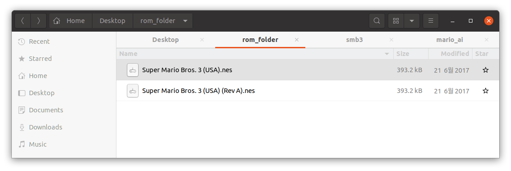

# Introduction
Training a Deep Learning agent for the Super Mario Bros 3 game

# Requirement
- OpenAI Gym 0.21.0 version: ```pip install gym==0.21.0```
- Gym Retro: https://github.com/openai/retro
- ROM file of the Super Mario Bros. 3 (USA) (Rev A): https://wowroms.com/en/roms/nintendo-entertainment-system/super-mario-bros.-3/23771.html

| :warning: WARNING          |
|:---------------------------|
| There are various kind of ROM version for SMB3. Among them, you need to download the file which as the 'Rev A' tag in the name. Otherwise, Gym Retro can not import it. |



After installing the Gym Retro and downloading the ROM file, please run the below command for importing the ROM into Gym Retro.

```
$ python -m retro.import /home/[your user name]/[rom_file_folder/
```

You should see the 'Imported 1 games' message to run the game. It says 'Imported 1 games' if there is some problem in your ROM file. 


```
$ python -m retro.import /home/[your user name]/[rom_file_folder]
```

Next, you should copy the stage files into your Gym Retro installing location. Please run the below Python code to see the path.

```
$ import retro
$ retro.__file__
```

Move to data/stable/SuperMarioBros3-Nes folder of root path of the Gym Retro. Then, copy [all state files](https://github.com/kimbring2/mario_ai/tree/main/state) of this repositoty under that folder.


