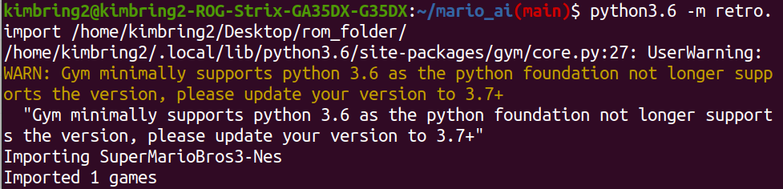

# Introduction
Training a Deep Learning agent for the Super Mario Bros 3 game

# Requirement
- Gym Retro: https://github.com/openai/retro
- ROM file of the Super Mario Bros. 3 (USA) (Rev A): https://wowroms.com/en/roms/nintendo-entertainment-system/super-mario-bros.-3/23771.html

| :warning: WARNING          |
|:---------------------------|
| There are various kind of ROM version for SMB3. Among them, you need to download the file which as the 'Rev A' tag in the name. Otherwise, Gym Retro can not import it. |


After installing the Gym Retro and downloading the ROM file, please run the below command for importing the ROM into Gym Retro.

```
python -m retro.import /home/[your user name]/[rom_file_folder/
```


